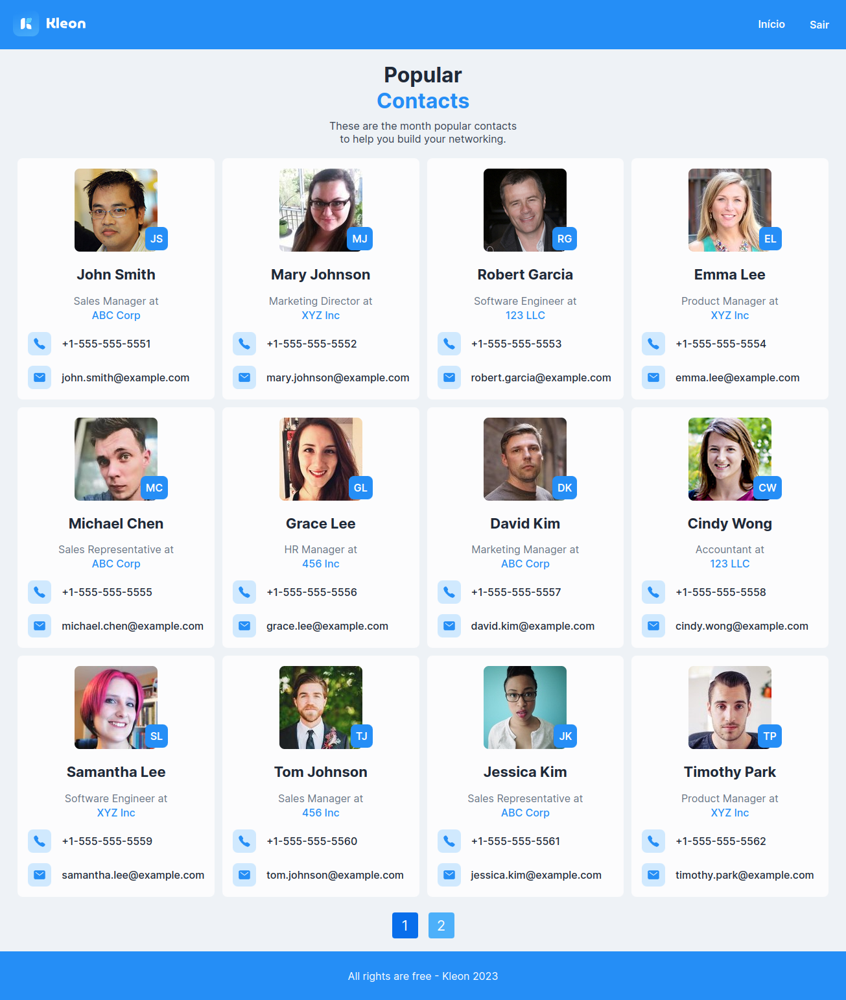

# Hello!

This is a full stack app built with Next.js, Golang, Docker and PostgreSQL.

There are some special concepts about a real app, like api, fetching data, database connection, env vars, authentication, styling, image serving, docker and so on.

Leave a star if you like it! :D

Home Page


Sign In Page


Sign Up Page


## Important

`.env` files were commited to simplify your work.

## Install Docker

Follow the instructions in the Docker official [docs](https://docs.docker.com/engine/install/ubuntu/)

## Start backend application

You have to use Docker Compose, just run this inside the `kleon` folder:

```bash
docker compose up
```

The first time you execute this docker compose app, it may take a bit longer, just wait.
If you are waiting for so long, just refresh backend app, to do this, just save or press `CTRL` + `S` in any `.go` file.

## Start frontend application

You doens't need to use Docker in frontend, just run this inside the `kleon/frontend` folder:

```bash
yarn dev
```
